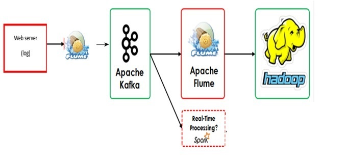

# 🌐 Web Log Data Pipeline
📌 Objective
This project demonstrates a real-time data ingestion and analytics pipeline built to simulate and analyze web traffic using open-source tools. It showcases how raw server logs can be transformed into actionable insights using scalable technologies like Apache Kafka, Flume, Spark, and HDFS.

## 🏢 Business Context
Modern web platforms generate massive volumes of traffic logs. These logs contain valuable signals about user behavior, system health, and security threats. This pipeline enables:
- Real-time monitoring of web activity
- Behavioral analytics for users and bots
- Scalable log storage for historical analysis
- Streamlined architecture for future ML integration
## 🔹 Components
- Nginx: Simulates real-time web traffic, generating structured access logs.
- Apache Flume: Uses the TAILDIR source to ingest logs line by line and stream them to Kafka.
- Apache Kafka: Acts as a distributed buffer, transmitting log events as byte messages.
- Apache Spark (Structured Streaming): Consumes Kafka logs, parses them into structured JSON, and performs real-time analytics.
- HDFS: Stores both raw and parsed logs for long-term access and batch processing.

## 📊 Analytics & Results
### ✅ Real-Time Monitoring
Using Spark Structured Streaming, the pipeline tracks:
- Traffic volume per minute
- Spikes or drops in request rates
- HTTP status code distribution (e.g., 200, 404, 500)
### ✅ User Behavior Analysis
Parsed logs enable:
- Identification of most requested URLs
- Detection of top user agents (browsers, bots)
- Frequency analysis of IP addresses (useful for geo-mapping or security alerts)
## Data Flow & Format
- Raw Format: Logs are preserved in their original Nginx format in HDFS.
- Kafka Format: Messages are transmitted as byte arrays.
- Parsed Format: Spark converts logs to structured JSON for downstream use.
## 📁 Repository Structure
├── flume-config/
│   └── nginx-taildir.conf
├── spark-streaming/
│   └── log_parser.py
├── nginx/
│   └── default.conf
├── README.md

